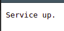
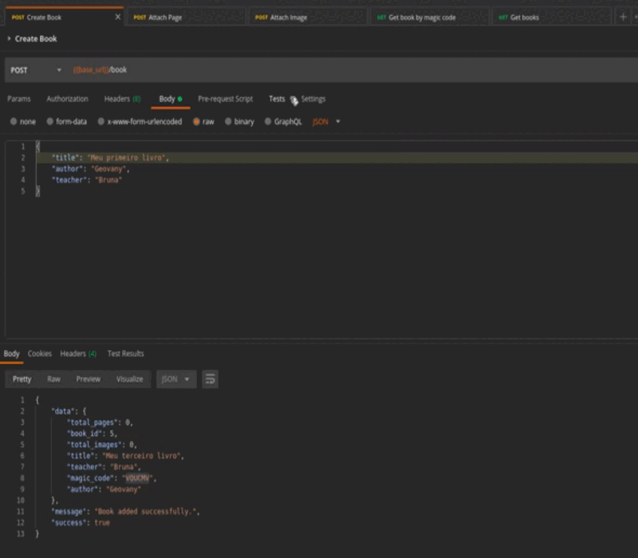

# BOOK-API

API para criação de livros. Nela são mantidas informações de um livro criado, suas páginas e as ilustrações.

## Começando

## Pré-requisitos

- Docker
- Docker-compose
- HTTP Client (Recomendação: Postman) - Utilizados para os testes
- Permissão para execução de comandos através do Makefile

> [!NOTE]
> Alguns comandos do Makefile utilizam recursos do linux, então leia com atenção as etapas pois pode ser sugerido uma etapa alternativa dependendo do sistema operacional.

## Execução

1 - Clone o projeto:

```
$ git clone https://github.com/geovanymds/book-api.git
```

2 - Abra o terminal dentro do diretório do projeto.

3 - Primeiro é preciso copiar as variáveis de ambiente do arquivo .env.example. Caso esteja utilizando o linux, pode utilizar o comando abaixo:

```
$ make copy
```

No windows a alternativa é copiar o conteúdo do arquivo original manualmente para o de destino.

4 - Na primeira inicialização utilize o seguinte comando no terminal:

```
$ make build
```

Nas próximas execuções é possível utilizar `$ make up` para iniciar o projeto ou `$ make stop` para parar o container.

5 - Para verificar se o servidor está sendo executado, abra o navegador e vá para o endereço <http://localhost:8000/>. A mensagem abaixo deverá ser exibida no navegador:
</br>


## Testes

A documentação das rotas está disponível através do Swagger no link <http://localhost:8000/docs>. Para auxiliar ainda está disponível no diretório docs/collections a collection e as variáveis de ambiente para serem utilizadas no Postman. É recomendável utilizar este Cliente HTTP pois as chamadas já estão prontas, porém é possível também utilizar outro com as informações fornecidas pelo Swagger.

1 - Importe as collections no postman

2 - Importe as variáveis de ambiente

3 - Para realizar os testes será utilizado o seguinte fluxo:

**CRIAR LIVRO** -> **ADICIONAR PÁGINAS** -> **ADICIONAR IMAGENS** -> **RECUPERAR INFORMAÇÕES DO LIVRO**

> [!NOTE]
> Esta é somente uma sugestão de testes, pois outros podem ser realizados pelo usuário.

4 - Crie um livro através da chamada **Create Book**. Todos os campos do corpo da requisição são obrigatórios. Ela retorna, dentre outras informações, o atributo **magic_code**. Ele será utilizado para recuperar informações do livro e adicioná-las também, então guarde-o.

5 - Execute a chamada **Attach page** para adicionar uma página ao livro. Note que o código mágico deve ser fornecido aqui, no corpo darequisição. É possível executá-la até 6 vezes para o mesmo livro, de forma que o número da página esteja entre 1 e 6, inclusive, não se repita em chamadas posteriores e o máximo de caracteres para o campo text são 1500.

6 - Execute a imagem **Attach image** para adicionar ilustrações ao livro. Ela recebe como parâmetro da rota atributo **magic_code** e também pode ser executada até 6 vezes para o mesmo livro e o corpo da requisição é do tipo form-data. São aceitos os formatos .png, .jpeg e .jpg.



Ainda é possível visualizar as imagens armazenadas com as urls fornecidas na última chamada.

## Outros recursos

Durante a execução do docker-compose são instanciados dois serviços, o da api e o do banco de dados (Postgres).

Acesso ao banco de dados:

```
$ make db
```

Aqui é solicitada a senha do banco e ela é encontrada nos arquivos .env e .env.example. Dentro do terminal do sgdb ainda é possível realizar consultas e alterações no banco e tabelas através de queries.

-> Acesso ao container da api:

```
$ make api
```

Foi utilizado para instalação de dependências dentro do container.

-> Atualização do requirements.txt:

```
$ make freeze
```
